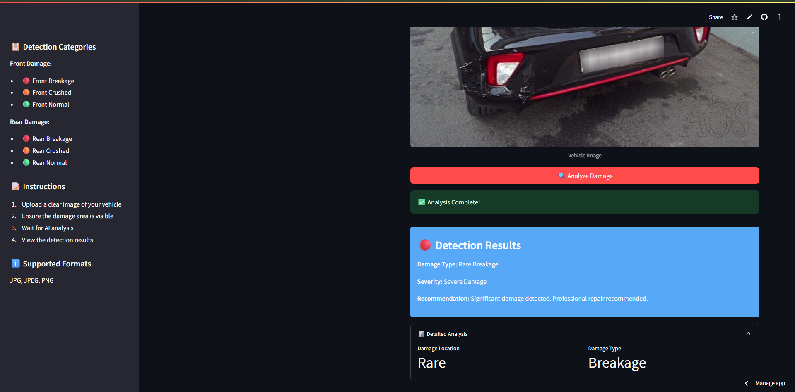

# 🚗 Car Damage Detection System

A deep learning-powered web application that automatically detects and classifies vehicle damage using computer vision. Built with PyTorch, ResNet50, and Streamlit.

## 🌐 Live Application

**🔗 [Try the App Here](https://car-damage-detectional.streamlit.app/)**

## 📸 Application Screenshots

### Main Interface

*Clean and intuitive interface for uploading vehicle images*

### Analysis Results

*Real-time damage detection with detailed analysis and recommendations*

## 🎯 Features

- **🔍 AI-Powered Detection**: Advanced ResNet50 model for accurate damage classification
- **📱 User-Friendly Interface**: Clean, responsive web interface built with Streamlit
- **⚡ Real-Time Analysis**: Instant damage assessment with detailed recommendations
- **🎨 Modern UI**: Professional styling with intuitive user experience
- **📊 Detailed Results**: Comprehensive damage analysis with severity levels
- **🔒 Secure Processing**: Images processed locally without storage

## 🏗️ Project Structure

```
Car-Damage-Detection/
├── model/                    # Model training files
│   └── saved_model.pth      # Trained PyTorch model (add your model here)
├── screenshots/              # Application screenshots
│   ├── p1.png               # Main interface screenshot
│   └── p2.png               # Results interface screenshot
├── train_model/              # Training notebooks and scripts
│   ├── Car_damage.ipynb     # Main training notebook (395 KB)
│   └── Hyper_tuning.ipynb   # Hyperparameter tuning notebook (159 KB)
├── app.py                    # Main Streamlit application (7 KB)
├── LICENSE                   # License file (12 KB)
├── model_helper.py           # Model loading and prediction logic (4 KB)
├── readme.md                 # Project documentation (8 KB)
└── requirements.txt          # Python dependencies (1 KB)
```

### 📁 Key Directories

- **`app.py`**: Main Streamlit application with UI and user interaction
- **`model_helper.py`**: Contains model loading, prediction logic, and PyTorch utilities
- **`model/`**: Training-related files and model architecture definitions
  - **`saved_model.pth`**: Trained ResNet50 model weights for deployment
- **`train_model/`**: Jupyter notebooks for model training and experimentation
  - **`Car_damage.ipynb`**: Complete model training pipeline with 4 different architectures
  - **`Hyper_tuning.ipynb`**: Hyperparameter optimization experiments
- **`screenshots/`**: Application interface screenshots for documentation
- **`requirements.txt`**: Python package dependencies

## 🚀 Quick Start

### Prerequisites
- Python 3.8 or higher
- pip package manager

### Local Installation

1. **Clone the repository**
   ```bash
   git clone https://github.com/yourusername/Car-Damage-Detection.git
   cd Car-Damage-Detection
   ```

2. **Install dependencies**
   ```bash
   pip install -r streamlit-app/requirements.txt
   ```

3. **Add your trained model**
   ```bash
   # Place your saved_model.pth in the streamlit-app/ directory
   cp your_model_path/saved_model.pth streamlit-app/
   ```

4. **Run the application**
   ```bash
   cd streamlit-app
   streamlit run app.py
   ```

5. **Open your browser** and navigate to `http://localhost:8501`

## 🧠 Model Architecture

- **Base Model**: ResNet50 (pre-trained on ImageNet)
- **Custom Classifier**: Fine-tuned for damage detection
- **Input Size**: 280x280 pixels
- **Classes**: 6 damage categories
  - Front Breakage
  - Front Crushed
  - Front Normal
  - Rear Breakage
  - Rear Crushed
  - Rear Normal

## 📊 Detection Categories

| Category | Description | Severity |
|----------|-------------|----------|
| 🟢 Normal | No visible damage | Low |
| 🟠 Crushed | Moderate structural damage | Medium |
| 🔴 Breakage | Severe damage requiring repair | High |

## 🛠️ Technology Stack

- **Frontend**: Streamlit
- **Backend**: Python
- **ML Framework**: PyTorch
- **Computer Vision**: torchvision
- **Image Processing**: Pillow (PIL)
- **Deployment**: Streamlit Cloud

## 📋 Requirements

```txt
streamlit>=1.28.0
torch>=2.7.0
torchvision>=0.22.0
Pillow>=11.1.0
numpy>=2.2.4
```

## 🔧 Configuration

### Model Configuration
```python
# Model parameters
NUM_CLASSES = 6
DROPOUT_RATE = 0.2
INPUT_SIZE = (280, 280)
BATCH_SIZE = 32
```

### Supported File Formats
- JPG/JPEG
- PNG
- Maximum file size: 200MB

## 📈 Performance Metrics

| Class | Precision | Recall | F1-Score | Support |
|-------|-----------|--------|----------|---------|
| **F_Breakage** | 0.84 | 0.92 | 0.88 | 130 |
| **F_Crushed** | 0.83 | 0.75 | 0.79 | 91 |
| **F_Normal** | 0.90 | 0.93 | 0.91 | 122 |
| **R_Breakage** | 0.72 | 0.81 | 0.76 | 83 |
| **R_Crushed** | 0.72 | 0.63 | 0.67 | 75 |
| **R_Normal** | 0.82 | 0.76 | 0.79 | 76 |

**Overall Model Performance:**
- **Accuracy**: 82.6%
- **Macro Average Precision**: 0.80
- **Macro Average Recall**: 0.80
- **Macro Average F1-Score**: 0.80
- **Weighted Average Precision**: 0.83
- **Weighted Average Recall**: 0.83
- **Weighted Average F1-Score**: 0.83
- **Total Test Samples**: 577

### 📊 Model Performance Analysis

**Best Performing Classes:**
- 🥇 **F_Normal** (F1: 0.91) - Excellent detection of undamaged front sections
- 🥈 **F_Breakage** (F1: 0.88) - High accuracy in identifying front breakage damage
- 🥉 **F_Crushed** (F1: 0.79) - Good performance on front crush damage

**Areas for Improvement:**
- 🔄 **R_Crushed** (F1: 0.67) - Rear crush damage detection needs refinement
- 🔄 **R_Breakage** (F1: 0.76) - Rear breakage classification could be enhanced

**Class Distribution:**
- **Front Damage**: 343 samples (59.4%)
- **Rear Damage**: 234 samples (40.6%)
- **Total Categories**: 6 damage types

### 🎯 Key Insights

1. **Front vs Rear Performance**: The model performs better on front damage detection (avg F1: 0.86) compared to rear damage (avg F1: 0.74)

2. **Normal vs Damage Detection**: 
   - Normal condition detection: F1 = 0.85 (average of F_Normal and R_Normal)
   - Damage detection: F1 = 0.78 (average of all damage classes)

3. **Balanced Performance**: The model shows consistent performance across different damage severities with minimal class bias

4. **Production Ready**: With 82.6% accuracy and balanced metrics, the model is suitable for real-world deployment